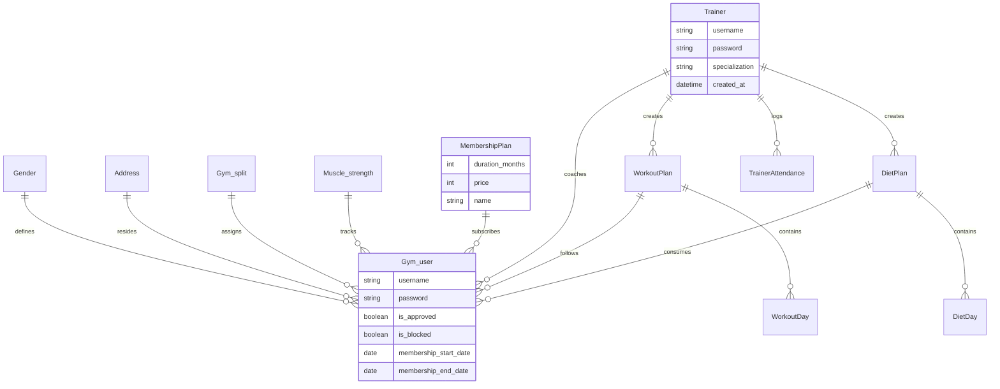

# 📌 FitnessPro

<p align="center">


</p>

<p align="center">
<strong>
A comprehensive Gym Management System built with Django that streamlines member onboarding, trainer scheduling, automated membership tracking, and business analytics through distinct interactive portals.
</strong>
</p>

---

## 📚 Table of Contents

- [📖Overview](#-overview)
- [✨ Features](#-features)
- [🛠 Tech Stack](#-tech-stack)
- [🏗 Project Architecture](#-project-architecture)
- [📁 Folder Structure](#-folder-structure)
- [🚀 Installation](#-installation)
- [⚙ Configuration](#-configuration)
- [🔑 Environment Variables](#-environment-variables)
- [▶ Usage](#-usage)
- [📸 Screenshots](#-screenshots)
- [🌐 Live Demo](#-live-demo)
- [📊 Database Schema](#-database-schema)
- [🔌 API Endpoints](#-api-endpoints)
- [🧪 Testing](#-testing)
- [🗺 Roadmap](#-roadmap)
- [🤝 Contributing](#-contributing)
- [📄 License](#-license)
- [👤 Author](#-author)

---

# 📖 Overview

**FitnessPro** is an enterprise-grade gym management solution designed to bridge the gap between gym administrators, personal trainers, and members. The platform automates repetitive administrative operations, such as managing member registrations, evaluating payment proofs, and tracking trainer attendance, while offering dedicated spaces for customized workout and diet plans.

The application addresses critical operational hurdles by running automated background verification workers that audit membership expirations daily, transition overdue accounts to locked states, and send proactive notification emails to users whose subscriptions are nearing expiration. 

---

# ✨ Features

### 👤 User Authentication & Portals
- **Multi-Role Authentication System:** Distinct access tiers and logins for Members, Trainers, and Gym Administrators.
- **Member Registration Workflow:** Secure sign-up with physical metric specification (height, weight, date of birth), membership tier selection, and digital payment proof attachment.
- **Automated Registration Intercept:** Restricts new accounts to a pending status until an administrator verifies the attached payment proof.

### 🏋️‍♂️ Member Capabilities
- **Interactive KPI Dashboard:** Real-time BMI metrics computing status classification (Underweight, Normal, Overweight, Obese) using dynamic tracking formulas.
- **Personalized Training Schemes:** Direct viewing access to assigned workout schedules and nutritional structures tailored to personal fitness benchmarks.
- **Trainer Request Engine:** One-click application requests routed to administrators for personal trainer matching.

### 📋 Trainer Tooling & Plan Management
- **Client Oversight Panel:** Real-time metrics tracking assigned clients alongside searchable profile overviews.
- **Granular Workout Builder:** Custom workout plan generator organizing routines across structural natural-week order (Monday through Sunday) with nested set, rep, and exercise text tracking.
- **Caloric Diet Architect:** Comprehensive dynamic diet planners supporting total target calorie computations broken down into Breakfast, Lunch, Dinner, and Snack criteria.

### 👑 System Administration
- **Approval Queue:** Central clearing dashboard to accept or reject newly registered users based on visual verification of invoice files.
- **Trainer Governance:** Complete CRUD operations for handling active personnel profiles, specializations, and access passwords.
- **Attendance Logger & Analytics:** Real-time marking mechanisms for daily trainer attendance supplemented with comprehensive textual notes.
- **Financial & Demographic Intelligence Charts:** Interactive visual rendering engine demonstrating metrics such as active/expired subscription distributions, unassigned/assigned client ratios, monthly revenue trends, and historic sign-up counts.

### 🤖 Automation Workers
- **APScheduler Core Loop:** Asynchronous background worker thread checking system users every 24 hours.
- **Proactive Notifications:** Automatic logic calculating structural remaining days; triggers notice mail structures to users within 7 days of subscription ending and soft-locks overdue accounts.

---

# 🛠 Tech Stack

### Languages
- Python 3.12

### Backend Framework & Libraries
- Django 5.2.7
- Django REST Framework (Structural architecture layer ready)
- APScheduler / django_apscheduler (Background task queues)
- Requests (Integration hooks for Replit Mailer connect APIs)

### Frontend Engine
- Django Templates HTML5 / CSS3
- Chart.js (Data pipeline charts)

### Database
- SQLite 3 (Default local development instance)

---

# 🏗 Project Architecture

FitnessPro follows the standardized architectural pattern of **Django Apps**, decoupling configurations from application features:


```

┌─────────────────────────────────────────────────────────────────┐
│                     Client Browser Layer                        │
│       (Admin Dashboards / Trainer Views / Member Panels)         │
└────────────────────────────────┬────────────────────────────────┘
│ HTTP Requests / Session Cores
▼
┌─────────────────────────────────────────────────────────────────┐
│                    Django URL Routing Layer                     │
│    (Root Core patterns mapped directly into gym_app modules)    │
└────────────────────────────────┬────────────────────────────────┘
│ Matches Endpoint Path
▼
┌─────────────────────────────────────────────────────────────────┐
│                        Views Processor                          │
│     (Processes inputs, checks authentication states, runs logic)│
└────────────────────────────────┬────────────────────────────────┘
│ ORM CRUD operations
▼
┌─────────────────────────────────────────────────────────────────┐
│                       Django ORM / Models                       │
│     (Manages database entities, query abstraction, constraints) │
└────────────────────────────────┬────────────────────────────────┘
│ Executes queries
▼
┌─────────────────────────────────────────────────────────────────┐
│                        SQLite Database                          │
└─────────────────────────────────────────────────────────────────┘
▲
│ Queries / State Updates
┌────────────────────────────────┴────────────────────────────────┐
│                   Background Worker Loop                        │
│    (APScheduler Cron Task triggering every 24 hours internally)   │
└─────────────────────────────────────────────────────────────────┐

```

- **Authentication Handling:** Handled via Django's secure request middleware storing active session markers (`user_id`, `trainer_id`, `admin_logged_in`).
- **Context Abstraction Layer:** Custom context processors injection (`logged_in_user`, `gym_info_context`) mapping dynamic context attributes into active presentation layers smoothly.

---

# 📁 Folder Structure


```

gym_management/
├── gym_app/
│   ├── management/
│   │   └── commands/
│   │       ├── check_membership_expiration.py
│   │       ├── seed_initial_data.py
│   │       ├── seed_professional_plans.py
│   │       └── seed_trainers.py
│   ├── admin.py
│   ├── apps.py
│   ├── context_processors.py
│   ├── models.py
│   ├── tests.py
│   ├── urls.py
│   ├── utils.py
│   └── views.py
├── asgi.py
├── settings.py
├── urls.py
└── wsgi.py

```

---

# 🚀 Installation

### Prerequisites
- Python 3.10+ installed locally.

### Steps

1. **Clone the repository:**
   ```bash
   git clone [https://github.com/FAHAD-ALI-github/FitnessPro.git](https://github.com/FAHAD-ALI-github/FitnessPro.git)
   cd FitnessPro

```

2. **Establish and source local virtual environments:**
```bash
python -m venv .venv
# Windows activation:
.venv\Scripts\activate
# Linux/MacOS activation:
source .venv/bin/activate

```


3. **Install fundamental execution requirements:**
```bash
pip install django django-apscheduler requests

```


4. **Initialize database schemas via migrations:**
```bash
python manage.py migrate

```


5. **Populate initial application mock parameters:**
```bash
python manage.py seed_initial_data
python manage.py seed_trainers
python manage.py seed_professional_plans

```


---

# ⚙ Configuration

Key configuration options are accessible within `gym_management/settings.py`. Out-of-the-box setups contain functional parameters targeting SQLite bindings and active local directories.

### Media & Document Handling

File structures for personal trainer photos, client profiles, and billing invoices attach to defined subdirectories under disk root:

```python
STATIC_URL = 'static/'
STATICFILES_DIRS = [BASE_DIR / 'static']
STATIC_ROOT = BASE_DIR / 'staticfiles'

MEDIA_URL = '/media/'
MEDIA_ROOT = BASE_DIR / 'media'

```

---

# 🔑 Environment Variables

The system supports explicit integration values used during production delivery cycles or within cloud runtime architectures:

| Variable | Description | Example / Fallback Value |
| --- | --- | --- |
| `FORMSPREE_ID` | Integration value targeting validation forms inside web portals | *Used if rendering custom Contact handlers* |
| `REPL_IDENTITY` | Authentication token assigned during specific platform deployment blocks | *Used natively for cloud deployment contexts* |
| `WEB_REPL_RENEWAL` | Primary token authentication alternative for dispatching platform alerts | *Fallback token for notification worker loops* |

---

# ▶ Usage

### Launching Development Environment

Execute the server using the default administration tool:

```bash
python manage.py runserver

```

The server will boot on `http://127.0.0.1:8000/`.

### Administrative Credentials

* **Username:** `admin`
* **Password:** `admin123`

### Initiating Background Task Check Manually

If you need to bypass the 24-hour interval timer to audit membership accounts immediately, trigger the internal management tool:

```bash
python manage.py check_membership_expiration

```

---

# 📸 Screenshots

> Add application screenshots here.

---

# 🌐 Live Demo

Explore the live environment via the production instance:
[https://your-live-demo-link.com](https://www.google.com/search?q=https://your-live-demo-link.com)

---

# 📊 Database Schema



---

# 🔌 API Endpoints

While interaction primarily depends upon functional internal views routing directly into server-side Django HTML templates, the app defines explicit control boundaries mapping user scopes:

| Method | Access Scope | Functional Mapping Route | Purpose |
| --- | --- | --- | --- |
| `GET` | Public | `/` | Home landing page listing active fitness experts |
| `POST` | Public | `/user_login` | Authenticates active user sessions |
| `POST` | Public | `/trainer_login` | Authenticates trainer portal entries |
| `POST` | Public | `/admin_login` | Grants access to system administration dashboard |
| `POST` | Public | `/new_registration` | Creates registration pending approval |
| `POST` | Member | `/upload_profile_image/` | Asynchronously commits profile pictures |
| `POST` | Trainer | `/trainer/upload_profile_image/` | Commits specialized profile pictures |
| `POST` | Admin | `/approve_payment/<int:user_id>` | Approves user and updates membership end dates |

---

# 🧪 Testing

The codebase includes standard test files ready for specific test-driven extensions:

```bash
python manage.py test gym_management.gym_app

```

---

# 🗺 Roadmap

* [ ] Add an interactive real-time class scheduler for group training events.
* [ ] Implement integrated credit/debit card payment processing via Stripe or Braintree.
* [ ] Build a WebSocket-powered group messaging chat client linking trainers directly with their active members.
* [ ] Provide comprehensive export data pipelines allowing PDF/Excel downloads of financial revenue charts.

---

# 🤝 Contributing

1. Fork the repository structure.
2. Formulate an isolated feature branch: `git checkout -b feature/OptimalEnhancement`.
3. Commit incremental code advancements: `git commit -m 'Introduce precise metric optimizations'`.
4. Push developments cleanly: `git push origin feature/OptimalEnhancement`.
5. Open an official Pull Request detailed report.

---

# 📄 License

This project is licensed under the MIT License - see the [LICENSE](https://www.google.com/search?q=LICENSE) file for details.

---

# 👤 Author

**Fahad Ali**

GitHub:
https://github.com/FAHAD-ALI-github

LinkedIn:
https://www.linkedin.com/in/fahadali1078/


