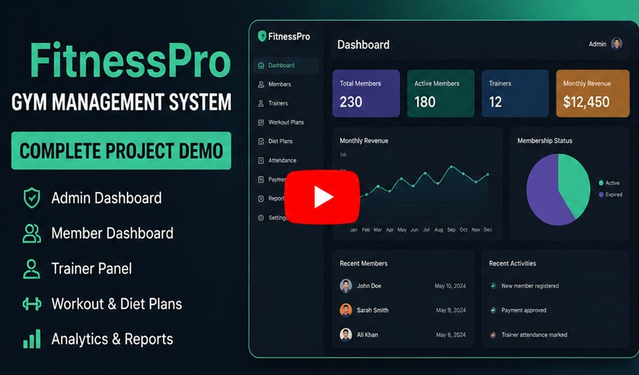
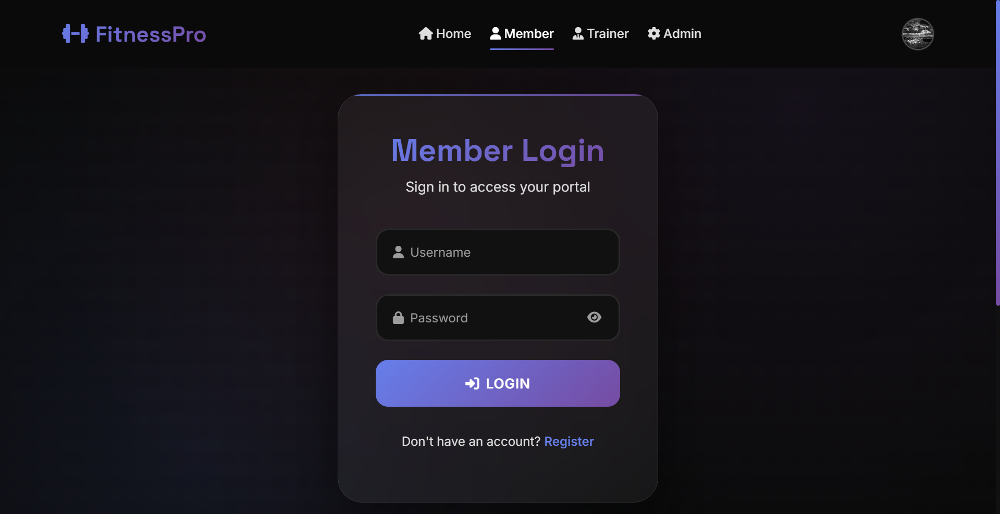
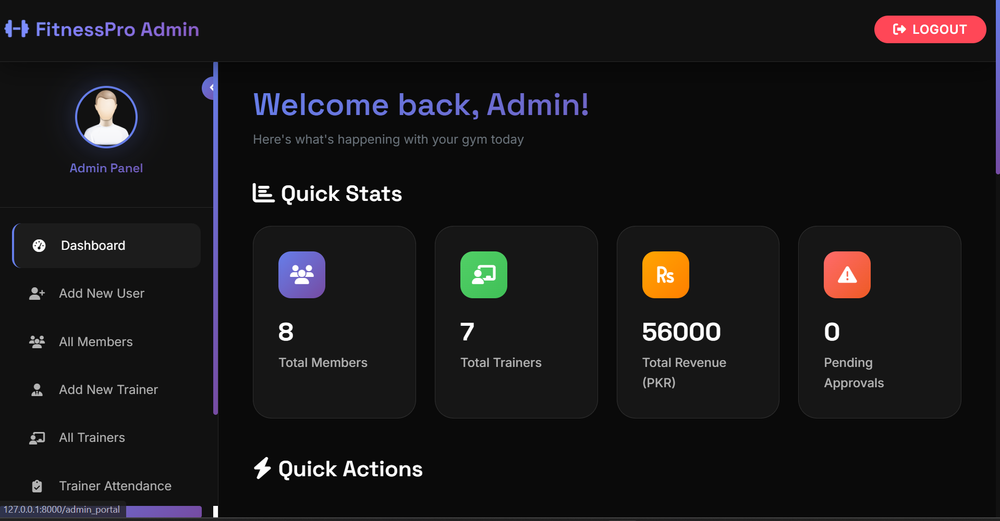
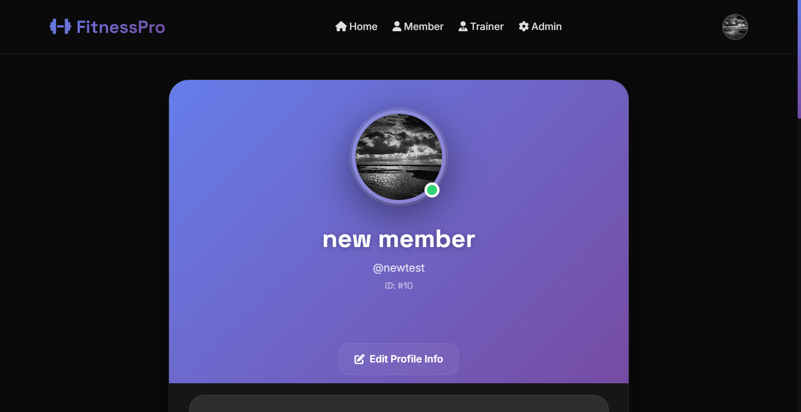
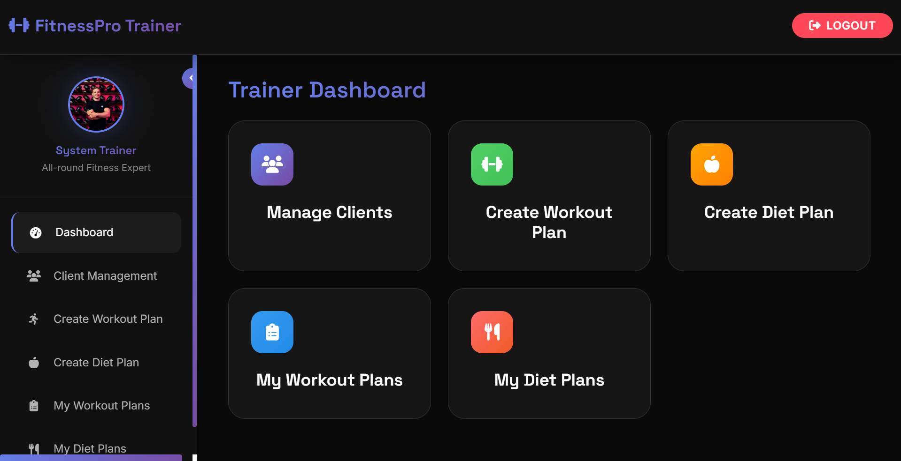
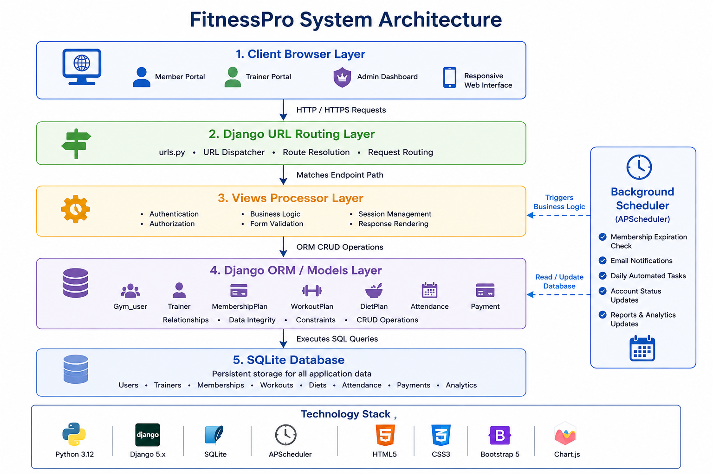
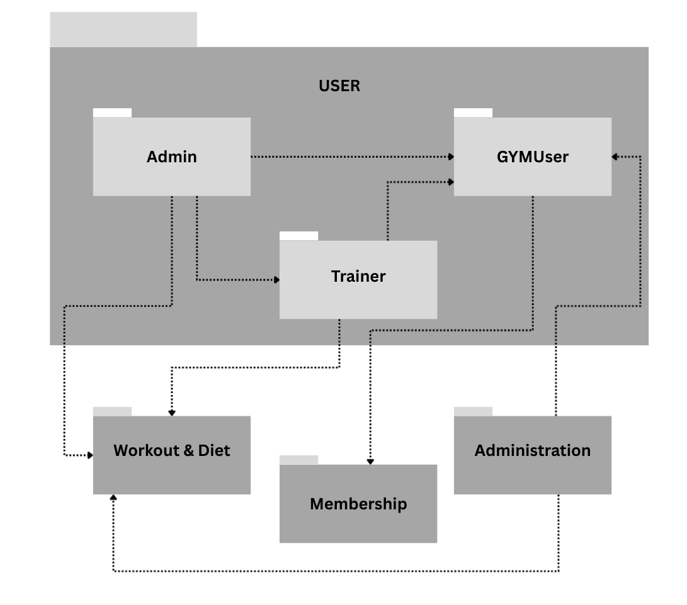
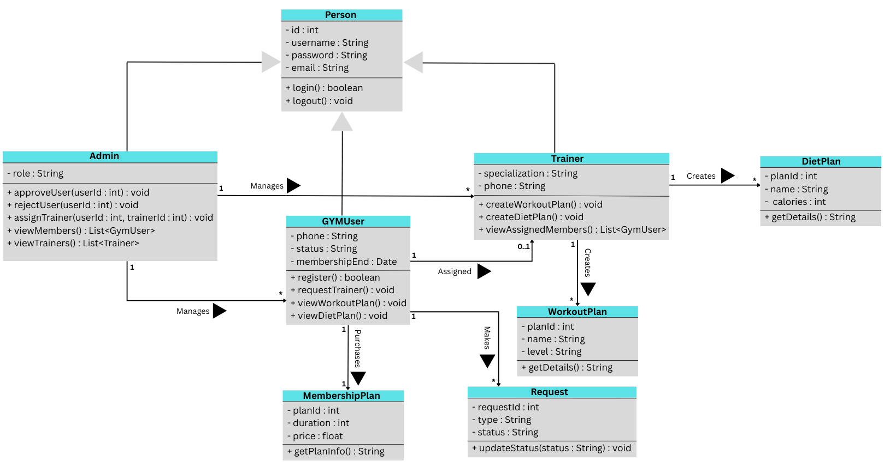
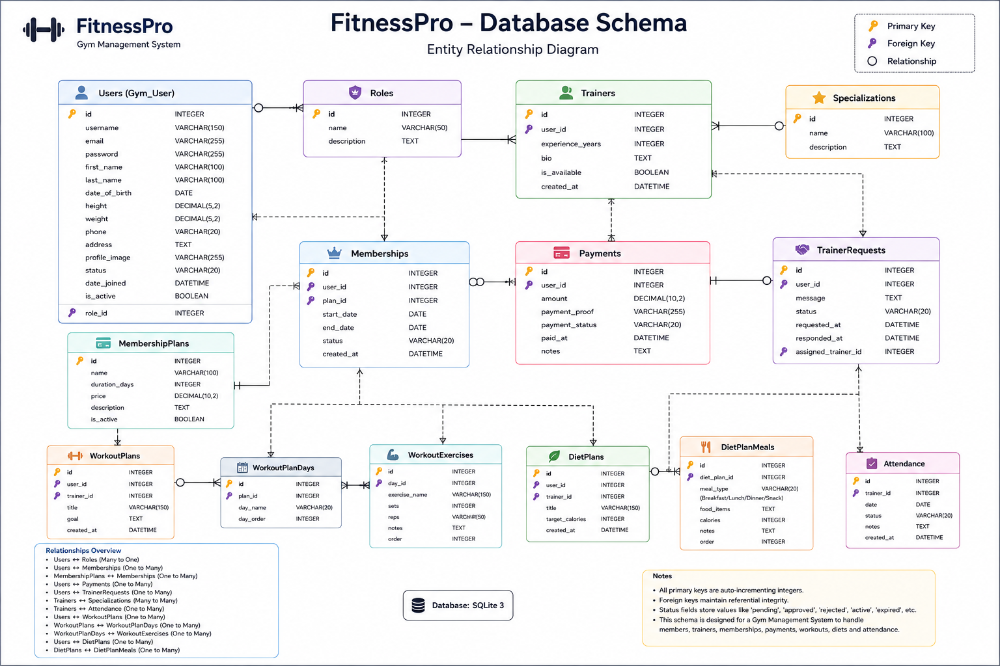

#  FitnessPro

<p align="center">


</p>

<p align="center">
<strong>
A comprehensive Gym Management System built with Django that streamlines member onboarding, trainer scheduling, automated membership tracking, and business analytics through distinct interactive portals.
</strong>
</p>

---

## 📚 Table of Contents

- [📖 Overview](#-overview)
- [✨ Features](#-features)
- [🛠 Tech Stack](#-tech-stack)
- [🎥 Project Demonstration](#-live-project-demonstration)
- [📸 Screenshots](#-screenshots)
- [🏗 System Architecture](#-system-architecture)
- [📦 Package Diagram](#-package-diagram)
- [📘 Class Diagram](#-class-diagram)
- [🗄 Database Schema](#-database-schema)
- [📁 Folder Structure](#-folder-structure)
- [🚀 Installation](#-installation)
- [⚙ Configuration](#-configuration)
- [🔑 Environment Variables](#-environment-variables)
- [▶ Usage](#-usage)
- [🌐 Live Demo](#-live-demo)
- [🔌 API Endpoints](#-api-endpoints)
- [🧪 Testing](#-testing)
- [🗺 Roadmap](#-roadmap)
- [🤝 Contributing](#-contributing)
- [📄 License](#-license)
- [👤 Author](#-author)

---

# 📖 Overview

**FitnessPro** is an enterprise-grade gym management solution designed to bridge the gap between gym administrators, personal trainers, and members. The platform automates repetitive administrative operations, such as managing member registrations, evaluating payment proofs, and tracking trainer attendance, while offering dedicated spaces for customized workout and diet plans.

The application addresses critical operational hurdles by running automated background verification workers that audit membership expirations daily, transition overdue accounts to locked states, and send proactive notification emails to users whose subscriptions are nearing expiration. 

---

# ✨ Features

### 👤 User Authentication & Portals
- **Multi-Role Authentication System:** Distinct access tiers and logins for Members, Trainers, and Gym Administrators.
- **Member Registration Workflow:** Secure sign-up with physical metric specification (height, weight, date of birth), membership tier selection, and digital payment proof attachment.
- **Automated Registration Intercept:** Restricts new accounts to a pending status until an administrator verifies the attached payment proof.

### 🏋️‍♂️ Member Capabilities
- **Interactive KPI Dashboard:** Real-time BMI metrics computing status classification (Underweight, Normal, Overweight, Obese) using dynamic tracking formulas.
- **Personalized Training Schemes:** Direct viewing access to assigned workout schedules and nutritional structures tailored to personal fitness benchmarks.
- **Trainer Request Engine:** One-click application requests routed to administrators for personal trainer matching.

### 📋 Trainer Tooling & Plan Management
- **Client Oversight Panel:** Real-time metrics tracking assigned clients alongside searchable profile overviews.
- **Granular Workout Builder:** Custom workout plan generator organizing routines across structural natural-week order (Monday through Sunday) with nested set, rep, and exercise text tracking.
- **Caloric Diet Architect:** Comprehensive dynamic diet planners supporting total target calorie computations broken down into Breakfast, Lunch, Dinner, and Snack criteria.

### 👑 System Administration
- **Approval Queue:** Central clearing dashboard to accept or reject newly registered users based on visual verification of invoice files.
- **Trainer Governance:** Complete CRUD operations for handling active personnel profiles, specializations, and access passwords.
- **Attendance Logger & Analytics:** Real-time marking mechanisms for daily trainer attendance supplemented with comprehensive textual notes.
- **Financial & Demographic Intelligence Charts:** Interactive visual rendering engine demonstrating metrics such as active/expired subscription distributions, unassigned/assigned client ratios, monthly revenue trends, and historic sign-up counts.

### 🤖 Automation Workers
- **APScheduler Core Loop:** Asynchronous background worker thread checking system users every 24 hours.
- **Proactive Notifications:** Automatic logic calculating structural remaining days; triggers notice mail structures to users within 7 days of subscription ending and soft-locks overdue accounts.

---

# 🛠 Tech Stack

### Languages
- Python 3.12

### Backend Framework & Libraries
- Django 5.2.7
- Django REST Framework (Structural architecture layer ready)
- APScheduler / django_apscheduler (Background task queues)
- Requests (Integration hooks for Replit Mailer connect APIs)

### Frontend Engine
- Django Templates HTML5 / CSS3
- Chart.js (Data pipeline charts)

### Database
- SQLite 3 (Default local development instance)

---

# 🎥 Live Project Demonstration

Experience the complete walkthrough of **FitnessPro**, including:

- ✅ User Registration
- ✅ Member Dashboard
- ✅ Trainer Panel
- ✅ Admin Dashboard
- ✅ Workout & Diet Plans
- ✅ Membership Management
- ✅ Analytics & Reports

### 📺 Watch the Complete Demo

<p align="center">
  <a href="https://youtu.be/EADJlJ750hc?si=g4_LrJDVJjy31yAe" target="_blank">
    
  </a>
</p>

<p align="center">
  <strong>👆 Click the thumbnail to watch the full demo on YouTube</strong>
</p>


---

# 📸 Screenshots

A quick preview of the application's user interface.

<p align="center">
  
  
</p>

<br>

<p align="center">
  
  
</p>

---

# 🏗 System Architecture

The following diagram presents the high-level architecture of the **FitnessPro** application, illustrating how client requests flow through the Django framework, interact with the database, and are supported by background services.

<p align="center">
  <a href="static/images/arch.png">
    
  </a>
</p>

<p align="center">
Click the diagram to view it in full resolution.
</p>

### Architecture Highlights

- Multi-role web interface for Members, Trainers, and Administrators.
- Django URL routing and request handling.
- Business logic implemented through Django Views.
- Data persistence using Django ORM and SQLite.
- Automated background jobs powered by APScheduler.
  
---

# 📦 Package Diagram

The package diagram illustrates the modular organization of the **FitnessPro** application and the dependencies between its core packages.

<p align="center">
  <a href="static/images/package-diagram.png">
    
  </a>
</p>

<p align="center">
Click the diagram to view it in full resolution.
</p>

### Package Overview

- **gym_management/** – Django project configuration
- **gym_app/** – Core application logic
- **management/commands/** – Custom Django management commands
- **templates/** – HTML templates
- **static/** – CSS, JavaScript and images
- **media/** – Uploaded user files

---


# 📘 Class Diagram

The class diagram represents the application's object-oriented structure, including the primary models, relationships, and responsibilities.

<p align="center">
  <a href="static/images/class-diagram.png">
    
  </a>
</p>

<p align="center">
Click the diagram to view it in full resolution.
</p>

### Key Components

- User & Authentication Models
- Trainer Management
- Membership Plans
- Workout Plans
- Diet Plans
- Attendance Tracking
- Payment Verification

---

# 🗄 Database Schema

The following Entity Relationship Diagram (ERD) illustrates the database design used by **FitnessPro**.

<p align="center">
  <a href="static/images/database-schema.png">
    
  </a>
</p>

<p align="center">
Click the diagram to view it in full resolution.
</p>

### Database Highlights

- Normalized relational schema
- Foreign key relationships
- Membership tracking
- Trainer assignments
- Workout & Diet management
- Attendance records
  
---

# 📁 Folder Structure


```

gym_management/
├── gym_app/
│   ├── management/
│   │   └── commands/
│   │       ├── check_membership_expiration.py
│   │       ├── seed_initial_data.py
│   │       ├── seed_professional_plans.py
│   │       └── seed_trainers.py
│   ├── admin.py
│   ├── apps.py
│   ├── context_processors.py
│   ├── models.py
│   ├── tests.py
│   ├── urls.py
│   ├── utils.py
│   └── views.py
├── asgi.py
├── settings.py
├── urls.py
└── wsgi.py

```

---

# 🚀 Installation

Follow these steps to run **FitnessPro** locally.

## Prerequisites

Make sure you have the following installed:

- Python 3.10+
- pip
- Git

## 1. Clone the Repository

```bash
git clone https://github.com/FAHAD-ALI-github/FitnessPro.git
cd FitnessPro
```

## 2. Create a Virtual Environment

```bash
python -m venv .venv
```

### Windows

```bash
.venv\Scripts\activate
```

### Linux / macOS

```bash
source .venv/bin/activate
```

## 3. Install Dependencies

```bash
pip install -r requirements.txt
```

> If `requirements.txt` is unavailable:

```bash
pip install django django-apscheduler requests
```

## 4. Apply Database Migrations

```bash
python manage.py migrate
```

## 5. Seed Initial Data

```bash
python manage.py seed_initial_data
python manage.py seed_trainers
python manage.py seed_professional_plans
```

## 6. Run the Development Server

```bash
python manage.py runserver
```

Open your browser and visit:

```
http://127.0.0.1:8000/
```


---

# ⚙ Configuration

FitnessPro uses Django's standard configuration system.

Key configuration options can be found in:

```text
gym_management/settings.py
```

## Static Files

```python
STATIC_URL = "static/"
STATICFILES_DIRS = [BASE_DIR / "static"]
STATIC_ROOT = BASE_DIR / "staticfiles"
```

## Media Files

```python
MEDIA_URL = "/media/"
MEDIA_ROOT = BASE_DIR / "media"
```

## Database

The project uses **SQLite** by default for local development.

You can easily switch to PostgreSQL or MySQL by updating the `DATABASES` configuration in `settings.py`.

---

# 🔑 Environment Variables

The system supports explicit integration values used during production delivery cycles or within cloud runtime architectures:

| Variable | Description | Example / Fallback Value |
| --- | --- | --- |
| `FORMSPREE_ID` | Integration value targeting validation forms inside web portals | *Used if rendering custom Contact handlers* |
| `REPL_IDENTITY` | Authentication token assigned during specific platform deployment blocks | *Used natively for cloud deployment contexts* |
| `WEB_REPL_RENEWAL` | Primary token authentication alternative for dispatching platform alerts | *Fallback token for notification worker loops* |

---

# ▶ Usage

## Start the Development Server

```bash
python manage.py runserver
```

Open:

```
http://127.0.0.1:8000/
```

---

## Default Administrator Credentials

| Username | Password |
|----------|----------|
| admin | admin123 |

---

## Run Membership Expiration Checker

```bash
python manage.py check_membership_expiration
```

This command manually triggers the APScheduler membership validation logic without waiting for the scheduled interval.

---

# 🌐 Live Demo

Experience the deployed version of the project.

<p align="center">

### 🚀 Live Website

https://fitnesspro.pythonanywhere.com/

</p>

> **Note**
>
> The hosted version may occasionally be unavailable due to free hosting limitations on PythonAnywhere.

---

# 📊 Database Schema


---

# 🔌 API Endpoints

The following table summarizes the primary routes exposed by the application.

| Method | Endpoint | Description |
|----------|----------|-------------|
| GET | `/` | Home Page |
| POST | `/user_login` | User Login |
| POST | `/trainer_login` | Trainer Login |
| POST | `/admin_login` | Administrator Login |
| POST | `/new_registration` | User Registration |
| POST | `/upload_profile_image/` | Upload User Profile Image |
| POST | `/trainer/upload_profile_image/` | Upload Trainer Profile Image |
| POST | `/approve_payment/<user_id>` | Approve Membership Payment |

---

# 🧪 Testing

Run Django's built-in test suite:

```bash
python manage.py test
```

Or test only the application:

```bash
python manage.py test gym_app
```
---

# 🗺 Roadmap

- PostgreSQL support
- Docker deployment
- REST API for mobile integration
- JWT Authentication
- Email verification
- Online payment gateway integration
- QR Code member check-in
- Real-time notifications
- WebSocket-powered messaging
- Export reports to PDF & Excel
- Multi-gym support
- Dark mode
      
---

# 🤝 Contributing

1. Fork the repository structure.
2. Formulate an isolated feature branch: `git checkout -b feature/OptimalEnhancement`.
3. Commit incremental code advancements: `git commit -m 'Introduce precise metric optimizations'`.
4. Push developments cleanly: `git push origin feature/OptimalEnhancement`.
5. Open an official Pull Request detailed report.

---

# 📄 License

This project is licensed under the MIT License - see the [LICENSE](https://www.google.com/search?q=LICENSE) file for details.

---
# 👤 Author

<div align="center">

## Fahad Ali

**Software Engineer | Full Stack Python Developer | AI Engineer**

[](https://github.com/FAHAD-ALI-github)
[](https://www.linkedin.com/in/fahadali1078)
</div>

---


